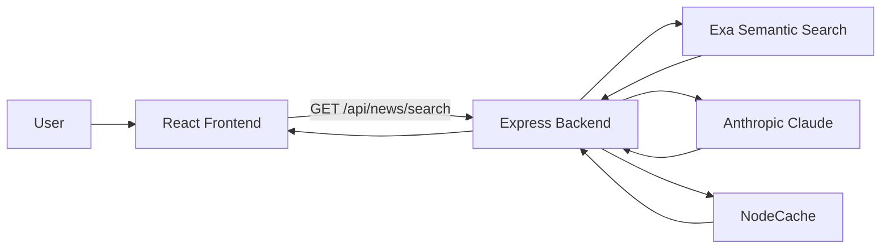

# AI News Bias Analyzer

AI News Bias Analyzer is a full-stack applied AI project that retrieves current news articles, estimates political bias, generates neutral summaries, and surfaces analytics that help compare source balance across a feed.

The project is designed to present well in a GitHub portfolio for internships, co-op roles, and entry-level data science, ML, and AI engineering positions. It combines retrieval, LLM inference, analytics, and a production-style web UI.

## What It Does

- Searches for recent articles using Exa semantic retrieval.
- Processes each article with Claude-based bias analysis.
- Generates neutral summaries to reduce editorial framing.
- Applies source-aware fallback scoring when the primary analysis fails.
- Tracks bias distribution, source mix, confidence, and recency for analytics.
- Displays results in a React frontend with filtering, pagination, and article detail cards.

## Why It Is Recruiter-Friendly

- End-to-end architecture: retrieval, preprocessing, model inference, API layer, caching, and frontend presentation.
- Clear ML outputs: bias score, label, confidence, reasoning, and key indicators.
- Data analytics angle: ideological spread, bucket counts, source diversity, and content-level signals.
- Production-minded engineering: rate limiting, security middleware, timeout handling, caching, and graceful fallbacks.
- Strong discussion value in interviews because it shows both implementation and product thinking.

## System Architecture



## Tech Stack

- Frontend: React 18, Tailwind CSS, Framer Motion, Axios, Lucide React, React Hot Toast
- Backend: Node.js, Express, Helmet, CORS, express-rate-limit
- AI / LLM: Anthropic Claude for bias analysis and neutral summarization
- Retrieval: Exa neural search API
- Caching: NodeCache in memory

## Implemented Algorithms And AI Logic

| Area | Algorithm / Method | What It Does |
| --- | --- | --- |
| Retrieval | Neural semantic search | Finds timely, query-relevant articles from the web |
| Source selection | Domain bucket sampling | Pulls from left, center, and right-leaning source groups |
| Deduplication | URL-based deduping | Removes duplicate search results |
| Bias analysis | Prompt-based LLM classification | Produces a 0-100 bias score, label, confidence, and reasoning |
| Fallback scoring | Source-aware analysis | Adjusts bias using source reputation and article content |
| Backup scoring | Keyword-weighted heuristic model | Provides resilient output when LLM or API calls fail |
| Summarization | Neutral abstractive summarization | Produces concise factual summaries with reduced framing bias |
| Analytics | Diversity and spread scoring | Estimates ideological spread and source balance in the feed |

## Data Analytics Features

The project already supports analytics-style outputs that are useful in a portfolio or dashboard context:

- Bias distribution across liberal, center, and conservative ranges.
- Confidence scores for each AI prediction.
- Source diversity across different domains and editorial perspectives.
- Diversity score as a proxy for ideological spread.
- Recency information through published timestamps and relative time formatting.

This makes the project easier to position as both an AI product and a data analytics system.

## API

Currently implemented endpoint:

- `GET /health`
- `GET /api/news/search?query=latest%20news&limit=10`

The frontend service layer also contains placeholders for future news, AI, and user-analytics endpoints.

## Local Setup

### 1. Install dependencies

```bash
cd news-platform/backend
npm install

cd ../frontend
npm install
```

### 2. Configure environment variables

Create `news-platform/backend/.env` with:

```env
PORT=5001
FRONTEND_URL=http://localhost:3000
NODE_ENV=development

ANTHROPIC_API_KEY=your_key_here
EXA_API_KEY=your_key_here
```

### 3. Run the app

Backend:

```bash
cd news-platform/backend
npm run dev
```

Frontend:

```bash
cd news-platform/frontend
npm start
```

Or use the helper script from inside the `news-platform` folder:

```bash
cd news-platform
./start.sh
```

### 4. Open the app

- Frontend: http://localhost:3000
- Backend health: http://localhost:5001/health

## Resume Bullet Ideas

- Built a full-stack AI news platform with React and Node.js that retrieves articles, scores political bias on a 0-100 scale, and generates neutral summaries.
- Designed a resilient AI inference pipeline with LLM analysis, source-aware fallback logic, and keyword-based backup scoring to improve reliability under failure conditions.
- Implemented data analytics features such as bias distribution, source diversity, recency tracking, and ideological spread measurement.
- Added caching, security middleware, and rate limiting to support production-style behavior and reduce API cost.

## High-Value Algorithms To Mention In Interviews

These are not all implemented in the current codebase, but they are strong upgrades to discuss or add next if you want the project to look more advanced.

### Supervised Bias Classification

- Fine-tune DeBERTa-v3, RoBERTa, or DistilBERT on labeled media-bias datasets.
- Add calibrated probabilities with Platt scaling or isotonic regression.
- Why it helps: more stable predictions than prompt-only scoring.

### Hybrid Retrieval And Ranking

- Combine BM25 with dense retrieval using Sentence Transformers.
- Add cross-encoder reranking for relevance and factual alignment.
- Why it helps: better article quality and stronger search relevance.

### Recommendation And Diversity Optimization

- Use contextual bandits such as LinUCB or Thompson Sampling.
- Optimize for relevance, novelty, and ideological diversity together.
- Why it helps: stronger personalization without creating echo chambers.

### Topic And Narrative Analysis

- Use BERTopic or LDA for topic discovery.
- Add stance detection for pro / neutral / contra framing.
- Why it helps: deeper analytics for newsroom and media-intelligence use cases.

### Trust, Monitoring, And MLOps

- Add drift detection with PSI or KL divergence.
- Use conformal prediction for uncertainty intervals.
- Add a human review queue for low-confidence predictions.
- Why it helps: shows production-grade AI thinking.

## Future Prediction Use Cases

- Forecast narrative shifts around elections or major events.
- Predict how ideological spread changes after breaking news.
- Detect early warning signs of echo chambers in reading behavior.
- Track how topic framing evolves over time with sequence models.

## Limitations

- The current bias analysis is LLM/prompt-driven, so outputs can vary with article phrasing.
- There is no persistent database yet, so analytics are mostly session-level.
- There is no published benchmark set yet for measuring precision, recall, and F1.

## Next Improvements

1. Add a labeled evaluation dataset and report metrics by bias class.
2. Store articles and predictions in PostgreSQL for longitudinal analytics.
3. Build a dashboard for source mix, confidence, latency, and drift.
4. Add Docker and CI checks for tests, linting, and build validation.

## License

MIT
