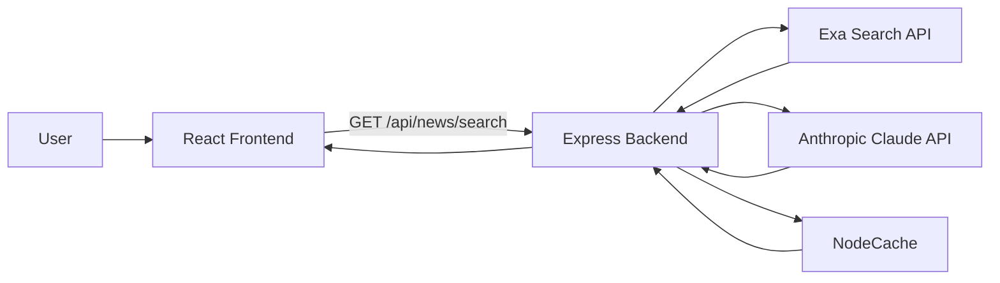

# AI News Bias Analyzer

Production-style Applied AI project for analyzing political bias in online news, generating neutral summaries, and surfacing a more balanced reading feed.

This repository is designed to showcase end-to-end AI engineering skills for internships, co-op roles, and entry-level data/ML positions.

## What This Project Does

- Retrieves recent articles from diverse news domains using Exa search.
- Scores political bias on a 0-100 scale using an LLM-based analysis pipeline.
- Generates neutral summaries to reduce emotionally loaded framing.
- Exposes a clean API and displays results in a responsive React UI.
- Computes diversity-oriented analytics such as bias spread and source mix.

## Why This Project Is Strong For Recruiting

- Full-stack AI architecture: data retrieval, model inference, caching, API layer, frontend visualization.
- Practical ML framing: measurable output (bias score, confidence, indicators).
- Real-world engineering: fallback logic, rate limiting, error handling, and cost-aware caching.
- Clear expansion path into advanced ML, recommender systems, and MLOps.

## Current Architecture



## Tech Stack

- Frontend: React 18, Tailwind CSS, Framer Motion, Axios
- Backend: Node.js, Express, Helmet, CORS, express-rate-limit
- AI/LLM: Anthropic Claude (bias analysis and neutral summarization)
- Retrieval: Exa neural search API
- Performance: NodeCache (in-memory cache)

## Implemented AI/ML Algorithms (In Code)

| Area | Algorithm / Method | Purpose | Status |
| --- | --- | --- | --- |
| Retrieval | Neural semantic search (Exa) | Find timely and relevant articles | Implemented |
| Source balancing | Domain-bucket sampling | Pull from left/center/right-leaning source groups | Implemented |
| Deduplication | URL-set deduping | Remove repeated articles | Implemented |
| Bias scoring | Prompt-based LLM classification | Predict bias score 0-100 + label + confidence | Implemented |
| Fallback 1 | Source-aware LLM assessment | Source reputation + article-level adjustment | Implemented |
| Fallback 2 | Keyword-weighted heuristic scoring | Resilient scoring if LLM/API fails | Implemented |
| Summarization | Neutral abstractive summarization | Create concise factual summaries | Implemented |
| Analytics | Standard deviation diversity score | Quantify ideological spread in article set | Implemented |

## Data Analytics Outputs

The platform currently supports analyst-friendly signals:

- Bias distribution: liberal / center / conservative bucket counts.
- Confidence tracking: per-article confidence from AI inference.
- Source diversity: mix of domains and ideological spread.
- Diversity score: normalized variance proxy from article bias scores.
- Time features: published timestamp and relative recency formatting.

These are useful for dashboarding and can be expanded into cohort-level analytics.

## API (Currently Available)

- GET /health
- GET /api/news/search?query=latest%20news&limit=10

Note: frontend service wrappers include additional endpoint placeholders for future expansion.

## Local Setup

### 1) Install dependencies

```bash
cd backend
npm install

cd ../frontend
npm install
```

### 2) Configure environment variables

Create backend/.env with:

```env
PORT=5001
FRONTEND_URL=http://localhost:3000
NODE_ENV=development

ANTHROPIC_API_KEY=your_key_here
EXA_API_KEY=your_key_here
```

### 3) Run the app

Backend terminal:

```bash
cd backend
npm run dev
```

Frontend terminal:

```bash
cd frontend
npm start
```

### 4) Open

- Frontend: http://localhost:3000
- Backend health: http://localhost:5001/health

## Suggested Resume Bullet Points

- Built an AI-powered news analysis platform using React and Node.js that scores political bias (0-100) and generates neutral summaries with LLM inference.
- Designed a resilient inference pipeline with multi-stage fallbacks (LLM source modeling + heuristic backup), improving robustness under API failure conditions.
- Engineered a domain-balanced retrieval strategy and diversity analytics to reduce source concentration and quantify ideological spread.
- Implemented caching, rate limiting, and secure API middleware to optimize latency/cost and production readiness.

## Advanced AI/ML Roadmap (Recommended For Portfolio Impact)

The following are strong, high-value upgrades to discuss in interviews. They are not fully implemented yet.

### A) Supervised Bias Classification

- Fine-tune DeBERTa-v3 or RoBERTa on labeled media-bias datasets.
- Output calibrated probabilities (Platt scaling / isotonic regression).
- Benefit: less prompt variance, more stable bias predictions.

### B) Retrieval + Ranking Improvements

- Hybrid retrieval: BM25 + dense vectors (Sentence Transformers).
- Cross-encoder reranking for top-k relevance and factual alignment.
- Benefit: better article quality and fewer noisy results.

### C) Recommendation and Diversity Optimization

- Contextual bandits (LinUCB / Thompson Sampling) for personalized-yet-diverse feeds.
- Multi-objective ranker for relevance, novelty, and ideological balance.
- Benefit: stronger recommendation science and measurable engagement lift.

### D) Topic and Narrative Analytics

- BERTopic or LDA for topic discovery.
- Stance detection model per topic (pro/neutral/contra).
- Benefit: richer analytics for product dashboards and media intelligence.

### E) MLOps and Trust

- Drift detection with PSI / KL divergence on feature and label distributions.
- Conformal prediction for uncertainty intervals on bias scores.
- Human-in-the-loop review queue for low-confidence predictions.
- Benefit: production-grade monitoring and trustworthy AI governance.

## Future Prediction Use Cases You Can Add

- Election-cycle narrative shift forecasting by outlet and topic.
- Event impact prediction on ideology spread (before/after major events).
- Early-warning signal for echo-chamber risk in user reading behavior.
- Temporal trend prediction of bias intensity using sequence models.

## Limitations (Transparent and Honest)

- Current bias analysis is LLM/prompt-driven and may vary by phrasing.
- No persistent database yet; analytics are session-level.
- No benchmark report yet against a held-out labeled test set.

## Next Milestones

1. Add a labeled evaluation dataset and report precision/recall/F1 by bias class.
2. Store articles and predictions in PostgreSQL for longitudinal analytics.
3. Ship a metrics dashboard (source mix, drift, confidence, latency, cost).
4. Containerize with Docker and add CI for tests/lint/build checks.

## License

MIT
